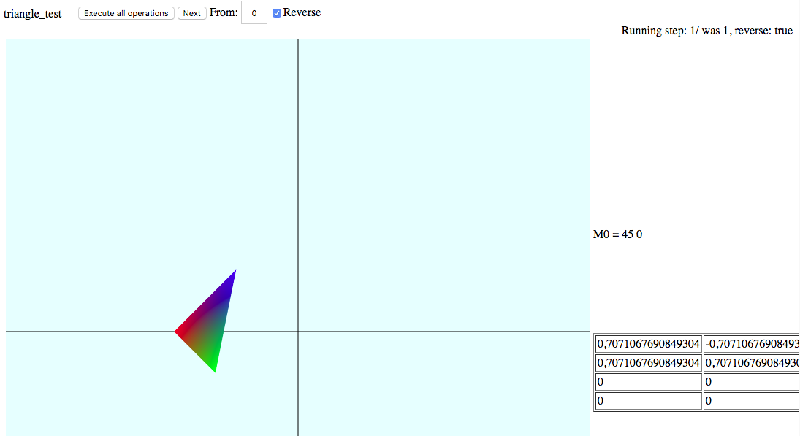

# w2dbench

```#webgl #js #triangle Triangle and polygon transformation work bench using Webgl```


El engine de visualización esta basado en un patrón *Model-View-Controller*. Contiene anotaciones de uso OpenWebgl, sobre todo en las vistas de cada demo en los métodos ```draw()```.

*¿Dónde puedo encontrar una demo o código?* Tengo el repo abierto con el código por si quiere echarle un vistazo o participar!

https://github.com/vrandkode/w2dbench

(demo: https://vrandkode.github.io/w2dbench/)




*¿Pueden haber pequeñas "issues" o bugs?* Posiblemente, no lo he testeado muy detalladamente, si vemos algo raro, no hay problemas en arreglarlo.

*¿Cómo funciona?* En la carpeta ```apps/``` hay una estructura que contiene cada demo.

```
apps/triangle/controller.js // controlador
apps/triangle/view.js // vista, en cada vista hay un modelo con un metodo .draw
apps/triangle/data/operations.js <- operations
````

*¿Engine.js?* Es el inicializador de contexto, inyecta el controlador y lo enlaza con la vista; con un pattern bastante usado en js.

